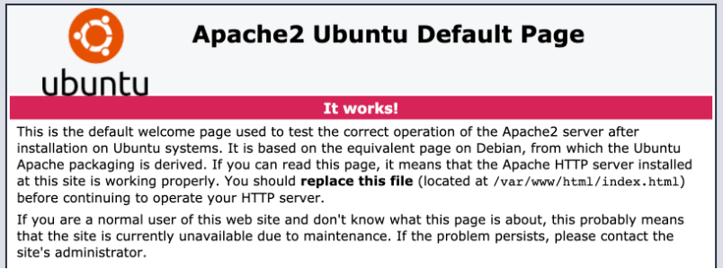
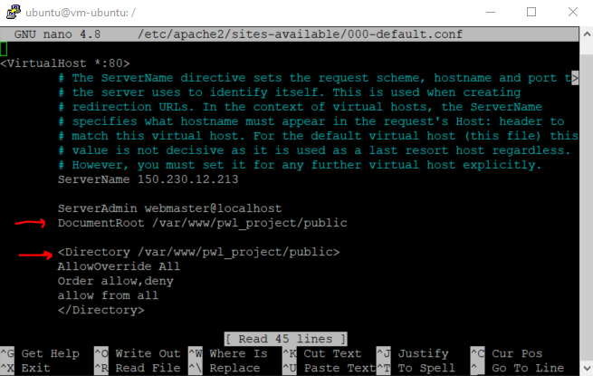

# Setup Project Oracle

# Requirement

- Akun Oracle Cloud
- MacOS, Linux atau Windows yang sudah diinstall `ssh`.

# 1. Set up Apache dan PHP

## Menginstall Apache2

1. Lakukan koneksi ke instance menggunakan SSH.

   `ssh -i <private-key-file> ubuntu@<ip-public-instance>`

2. Install Apache Server

   `sudo apt update`

   `sudo apt -y install apache2`

3. Restart Apache

   `sudo systemctl restart apache2`

4. Konfigurasi Firewall

   `sudo iptables -I INPUT 6 -m state --state NEW -p tcp --dport 80 -j ACCEPT`

   `sudo netfilter-persistent save`

5. Akses Apache Server pada browser menggunakan perintah `curl localhost` atau **http://public-ip-address**.

   

## Mengatur Hak Akses pada Direktori Apache2

- `sudo chmod -R 755 /var/www/`

- `sudo chmod -R 755 /etc/apache2/sites-available/`

- `sudo chmod -R 755 /etc/apache2/sites-enabled/`

- `sudo chown -R ubuntu:ubuntu /var/www/`

- `sudo chown -R ubuntu:ubuntu /etc/apache2/sites-available/`

- `sudo chown -R ubuntu:ubuntu /etc/apache2/sites-enabled/`

## Menginstall PHP 7

1.  Install PHP 7 menggunakan perintah berikut.

    `sudo apt -y install php libapache2-mod-php`

2.  Verifikasi Instalasi dan Restart Apache.

    `php -v`

    `sudo systemctl restart apache2`

# 2. Menginstall Composer Pada Ubuntu

Jalankan perintah berikut pada terminal

      php -r "copy('https://getcomposer.org/installer', 'composer-setup.php');"`

      php -r "if (hash_file('sha384', 'composer-setup.php') === '906a84df04cea2aa72f40b5f787e49f22d4c2f19492ac310e8cba5b96ac8b64115ac402c8cd292b8a03482574915d1a8') { echo 'Installer verified'; } else { echo 'Installer corrupt'; unlink('composer-setup.php'); } echo PHP_EOL;"

      sudo php composer-setup.php --install-dir=/usr/bin --filename=composer

Lakukan pengecekan pada terminal menggunakan perintah `composer`.

# 3. Melakukan Setup MySQL

1. Install MySQL

   `sudo apt install mysql-client-core-8.0`

2. Mengkoneksikan MySQL

   `mysql -u (admin-database) -p -h (ip-private-mysql)`

3. Membuat Database

   `create database nama_database;`

4. Memberikan akses pada Database

   `grant all privileges on nama_database.* to admin;`

5. Mengaktifkan ekstensi MySQL

   Untuk dapat mengaktifkan ekstensi ini, dapat dilakukan dengan mengakses direktori file PHP **cd /etc/php/7.4/apache2/php.ini**.

   Hilangkan tanda `;` untuk mengaktifkan ekstensi, lalu save.

6. Restart Apache2

   `sudo service apache2 restart`

   `sudo chown www-data:www-data -R *`

# 4. Integrasi Project Laravel pada Oracle

1.  Clone Project pada direktori `var/www/` menggunakan `git clone nama_project`.

2.  Masuk ke folder project yang telah di-clone, lalu ketikkan perintah `composer update`.

3.  Lakukan Generate Key dengan perintah `php artisan key:generate`.

4.  Edit pada file `.env` dan sesuaikan Database yang akan digunakan, kemudian save.

        DB_CONNECTION=mysql

        DB_HOST=ip-private-mysql

        DB_PORT=3306

        DB_DATABASE=nama_database

        DB_USERNAME=user-database

        DB_PASSWORD=password-database

5.  Lakukan konfigurasi Apache

    Konfigutasi Apache bertujuan agar Ip Address Instance yang diakses mengarah ke project yang telah kita integrasikan. File yang akan dikonfigurasi terletak pada **/etc/apache2/sites-available/000-default.conf**.

    Untuk dapat mengedit file tersebut, dapat menggunakan perintah sebagai berikut.

    `sudo nano /etc/apache2/sites-available/000-default.conf`

    Tambahkan kode berikut pada file

        DocumentRoot /var/www/nama_project/public

        <Directory /var/www/nama_project/public>

            AllowOverride All

            Order allow, deny

            allow from all

        </Directory>

    ilustrasinya sebagai berikut

    

6.  Restart Apache menggunakan perintah berikut

    `a2enmod rewrite`

    `sudo /etc/init.d/apache2/restart`

7.  Cek pada browser menggunakan IP Public Instance.
